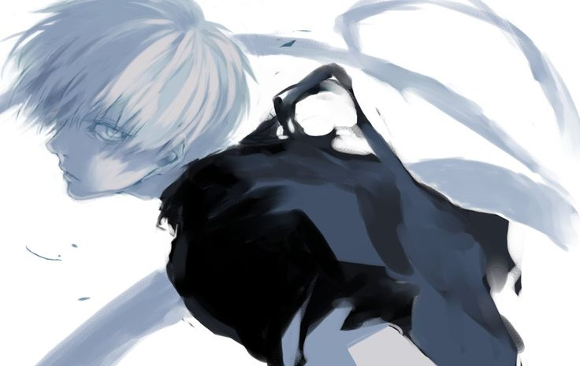

 

<table>
<tr>

<td width="30%" align="center">

  

<h2>Riyoshii</h2>

Frontend Developer

💻 Web Developer 
🎮 Game Developer 
📚 Programming Student

</td>

<td width="70%">

<h1>Hi 👋, I'm Riyoshii</h1>

<h3>A passionate frontend developer from Indonesia</h3>

I enjoy creating websites, learning programming,
and developing fun projects.

</td>

</tr>
</table>

---

<h2>👨‍💻 About Me</h2>

I'm a programming student from Indonesia who enjoys
learning web development, game development, and new technologies.

<ul>
<li>💻 Currently learning Web Development</li>
<li>🎮 Interested in Game Development</li>
<li>📚 Learning JavaScript & TypeScript</li>
<li>🗄️ Learning PHP & MySQL</li>
<li>🚀 Always trying to improve my programming skills</li>
</ul>

---

<h2>📫 How to reach me</h2>

---

<h2>⚡ Fun Fact</h2>

✨ I Like Girl

---

<h2>🤝 Connect with me</h2>

---

<h2>🛠️ Languages and Tools</h2>

---

<h2>🚀 My Projects</h2>

<table>
<tr>

<td width="50%">

<h3>📋 DailyBoard</h3>

A daily task management website.

<ul>
<li>Task Management</li>
<li>Search Tasks</li>
<li>Dark Mode</li>
<li>Notes</li>
<li>Local Storage</li>
<li>Weather Information</li>
</ul>

</td>

<td width="50%">

<h3>🎮 Anime Fighter</h3>

A 2D anime fighting game project.

<ul>
<li>Multiple Characters</li>
<li>Basic Attack</li>
<li>Ultimate Skills</li>
<li>HP System</li>
<li>Round System</li>
<li>CPU Opponent</li>
</ul>

</td>

</tr>

<tr>

<td width="50%">

<h3>🇯🇵 Japanese Learning</h3>

A website for learning Japanese.

<ul>
<li>Daily Lessons</li>
<li>Writing Practice</li>
<li>Daily Notes</li>
<li>Progress Tracking</li>
</ul>

</td>

<td width="50%">

<h3>📚 Library System</h3>

A PHP & MySQL library management system.

<ul>
<li>Book Management</li>
<li>Category Management</li>
<li>Student Data</li>
<li>Borrowing Data</li>
</ul>

</td>

</tr>
</table>

---

<h2>📖 Currently Learning</h2>

---

<h2>🎯 Goals</h2>

<ul>
<li>🚀 Improve my programming skills</li>
<li>🌐 Build better websites</li>
<li>🎮 Create my own games</li>
<li>🤖 Learn more about AI</li>
<li>💡 Create useful projects</li>
</ul>

---

<h3>✨ Thanks for visiting my profile! ✨</h3>

